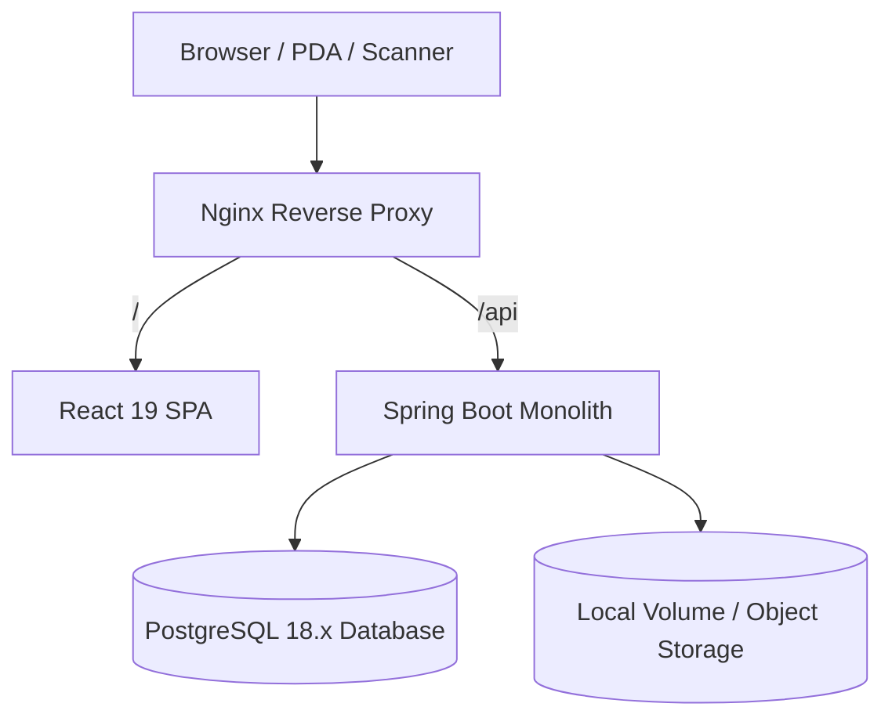

# Architecture Specification

## 1. Overview & Architectural Principles

The Factory Management Platform is built as a **Modular Monolith** in Java / Spring Boot with a React Single Page Application (SPA).

Key Architectural Decisions:
1. **Single Shared Codebase, Independent Deployments:** No multi-tenant database partitioning (`tenant_id`). Each customer has their own dedicated database and container deployment.
2. **Modular Monolith:** No microservices for MVP. Modules communicate through explicit service interfaces and DTOs within the monolith.
3. **Transaction-Driven Inventory:** Never mutate stock directly. All stock changes are recorded as atomic `stock_transactions`, updating current balances in `inventory_balances`.
4. **Configuration-Driven White-labeling:** Branding (name, logo, currency, formats) and module feature flags are configured via database settings or environment variables without changing source code.

## 2. High-Level Architecture

## 3. Business Flow

```mermaid
flowchart LR
    SUP[Supplier] --> PO[Purchase Order]
    PO --> GR[Goods Receipt]
    GR --> RM[Raw Material Inventory]
    RM --> MO[Production Order]
    MO --> PROD[Production Operations]
    PROD --> FG[Finished Goods Inventory]
    FG --> SO[Sales Order]
    SO --> DEL[Delivery Fulfillment]
    DEL --> CUS[Customer]
```

## 4. Module Boundaries & Rules
- **No business logic in Controllers:** Controllers handle HTTP requests, input validation, and delegate to services.
- **Transactional integrity:** Use `@Transactional` on all workflows mutating stock balances and orders.
- **Concurrency control:** Use Pessimistic Locking (`@Lock(LockModeType.PESSIMISTIC_WRITE)`) or optimistic versioning (`@Version`) where concurrent inventory access could cause negative stock.
